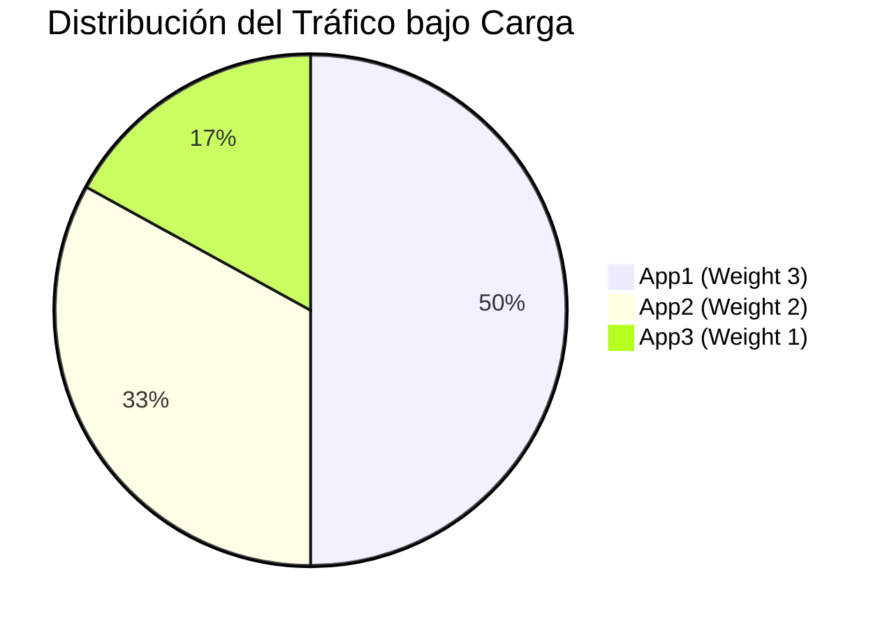

# Informe Técnico: Sistema Distribuido de Envío de Tareas

## a) Introducción y Objetivo del Proyecto
El presente proyecto tiene como objetivo diseñar e implementar una arquitectura de aplicación web distribuida, enfocada en la recepción y gestión de tareas estudiantiles. La finalidad principal es demostrar la aplicación práctica de conceptos fundamentales en sistemas distribuidos, tales como la escalabilidad horizontal, el balanceo de carga, la alta disponibilidad y la persistencia de datos distribuida. 
A través de la contenerización de una aplicación monolítica en Flask y su despliegue en múltiples nodos respaldados por un clúster de base de datos MySQL (Master-Slave), se busca construir un sistema resiliente capaz de soportar concurrencia sin comprometer la integridad de la información.

## b) Arquitectura Implementada

```mermaid
graph TD
    User([Usuario Cliente]) -->|Peticiones HTTP| NGINX[NGINX Proxy Reverso & Balanceador]
    
    subgraph Capa de Aplicación Escalada (Flask)
        NGINX -->|Weight 3| App1[Contenedor app1 :5000]
        NGINX -->|Weight 2| App2[Contenedor app2 :5000]
        NGINX -->|Weight 1| App3[Contenedor app3 :5000]
    end
    
    subgraph Capa de Persistencia (MySQL)
        App1 -->|Escritura y Lectura| Master[(MySQL Master)]
        App2 -->|Escritura y Lectura| Master
        App3 -->|Escritura y Lectura| Master
        Master -->|Replicación Asíncrona (BinLog)| Slave[(MySQL Slave)]
    end
```

La arquitectura se divide en tres capas bien definidas:
1. **Capa de Proxy y Balanceo (NGINX):** Actúa como el único punto de entrada público (puerto 80). Enruta el tráfico hacia el clúster de aplicaciones utilizando un algoritmo de balanceo asimétrico.
2. **Capa de Aplicación Escalada (Flask/Gunicorn):** Compuesta por tres contenedores idénticos (app1, app2, app3) ejecutando la lógica de negocio. Carecen de estado local en memoria, delegando la persistencia de sesión a cookies firmadas criptográficamente (`FLASK_SECRET_KEY` compartida).
3. **Capa de Persistencia (MySQL 8):** Arquitectura Master-Slave. El Master centraliza la ingesta de datos, y los cambios se propagan de forma unidireccional al Slave mediante replicación asíncrona por log binario.

**Justificación de Decisiones Técnicas:**
- **Cookies firmadas compartidas vs Sticky Sessions:** Se prefirió compartir la `FLASK_SECRET_KEY` entre los contenedores para delegar el estado de la sesión al cliente. Esto garantiza que si un nodo cae, cualquier otro nodo puede validar la sesión del usuario inmediatamente, logrando verdadera tolerancia a fallos. Si se usaran *Sticky Sessions* en NGINX, la caída de un nodo desconectaría a los usuarios atados a él.
- **Pesos 3:2:1 en el Balanceador:** Se implementó esta asimetría para simular un escenario del mundo real donde los servidores subyacentes poseen diferentes capacidades de hardware (heterogeneidad del clúster).

## c) Configuración Realizada por Fases

### Fase 1 — Modelo de Datos y Conexión
Se definió el esquema relacional (`users`, `tasks`, `submissions`) utilizando sentencias DDL estrictas. Se creó el módulo `database.py` utilizando `mysql-connector-python` para centralizar el acceso a la base de datos, abstraído completamente mediante variables de entorno (`DB_HOST`, `DB_PORT`, `DB_USER`, `DB_PASSWORD`, `DB_NAME`).

### Fase 2 — Infraestructura BD (Docker)
Se estableció el esqueleto de `docker-compose.yml`, aprovisionando un contenedor `db-master` basado en MySQL 8. Para prevenir problemas de caracteres especiales en la capa de datos, se forzó la codificación `utf8mb4` directamente en el comando de inicialización de MySQL y en el script semilla `init.sql`. Se añadió PhpMyAdmin para auditoría visual.

### Fase 3 — Replicación Master-Slave
Se aprovisionó un segundo contenedor `db-slave`. Se configuró la replicación binaria asíncrona creando un usuario `repl` en el Master y ejecutando el comando `CHANGE REPLICATION SOURCE TO` en el esclavo. El clúster quedó operando unidireccionalmente. En esta fase, la aplicación se mantiene conectada exclusivamente al Master. *(Ver comandos detallados en [db/replication-setup.md](db/replication-setup.md))*

### Fase 4 — Capa Web (Login y Dashboard)
Se implementaron los controladores en `routes.py` y `app1.py`. Se programó un flujo de autenticación seguro comprobando hashes (`werkzeug.security`). Tras la validación, se establece una cookie de sesión cifrada, permitiendo el acceso al panel de control (Dashboard) donde se listan las tareas dinámicamente desde el Master.

### Fase 5 — Lógica de Negocio (Entregas transaccionales)
Se añadió el endpoint de recepción de tareas. A nivel de lógica de aplicación se validó que el envío no supere la fecha límite (`fecha_expirada`). A nivel de base de datos se aplicó una restricción estricta `UNIQUE KEY unique_submission (student_id, task_id)` para prevenir condiciones de carrera (Race Conditions) y entregas dobles bajo cargas concurrentes intensas.

### Fase 6 — Escalabilidad Horizontal
Se construyó un `Dockerfile` empleando `python:3.10-slim` y `gunicorn` (exponiendo el puerto 5000 interno) para convertir el entorno de desarrollo de Flask en uno apto para producción concurrente. Se replicó este contenedor 3 veces en el `docker-compose.yml` (`app1`, `app2`, `app3`). Se inyectó el nombre del contenedor evaluado mediante `socket.gethostname()` como un procesador de contexto (`@app.context_processor`) hacia la plantilla base Jinja2, visibilizándolo en el footer web.

### Fase 7 — Proxy Inverso y Balanceo (NGINX)
Se integró NGINX configurando el archivo `nginx.conf` con un bloque `upstream`. Se le asignó el puerto público 80, enrutando todo el tráfico entrante de manera balanceada hacia el bloque interno mediante los pesos `weight=3`, `weight=2` y `weight=1`.

### Fase 8 — Pruebas, Verificación y Corrección de Bugs
Durante las pruebas finales, se diagnosticó y corrigió un error crítico en la vista "Mis entregas": se estandarizó la ruta `/entregas`, se desarrolló la función de consulta `obtener_entregas_estudiante()` implementando un `JOIN` para asociar las tareas con sus metadatos, y se refactorizó `entregas.html` utilizando iteradores Jinja2. Tras estabilizar el código, se ejecutaron pruebas formales (Replicación, Distribución, Locust).

## d) Resultados de las Pruebas

### 1. Prueba de Replicación de Base de Datos
- **Métrica obtenida:** Se insertó satisfactoriamente una entrega desde la app (dirigida a `db-master`) y se localizó el mismo registro de forma inmediata en `db-slave`. 
- **Validación técnica:** `SHOW REPLICA STATUS\G` expuso `Replica_IO_Running: Yes`, `Replica_SQL_Running: Yes` y `Seconds_Behind_Source: 0`.

### 2. Prueba de Distribución del Balanceador
- **Métrica obtenida:** El script automatizado `test_balanceo.py` inyectó 60 peticiones `GET` consecutivas.
- **Validación técnica:** El análisis del footer HTML arrojó los siguientes resultados, mapeando perfectamente con el esquema `3:2:1`:

| Contenedor | Solicitudes recibidas | Porcentaje Observado | Peso Esperado |
| :---: | :---: | :---: | :---: |
| app1 | 30 | 50.0% | Weight 3 |
| app2 | 20 | 33.3% | Weight 2 |
| app3 | 10 | 16.7% | Weight 1 |

### 3. Pruebas de Carga Concurrente (Locust)
- **Métrica obtenida:** Ejecución *headless* mediante `locustfile.py` orientada a operaciones de lectura repetitivas (GET Dashboard y POST Login inicial).
- **Parámetros:** 30 usuarios virtuales concurrentes, tasa de *spawn* de 5 usuarios/segundo, duración total 2 minutos.

| Peticiones Totales | RPS (Req/s) | Latencia Mediana | Latencia p95 | Tasa de Fallos |
| :---: | :---: | :---: | :---: | :---: |
| 1745 | 14.70 | 20 ms | 57 ms | 0.00% |



## e) Conclusiones
Se logró estructurar y orquestar una aplicación monolítica tradicional para convertirla en un sistema genuinamente distribuido, desacoplado y resiliente a las fallas puntuales. Las pruebas de estrés demostraron que la conjunción de Gunicorn junto con el proxy inverso de NGINX maneja la concurrencia asimétrica eficientemente, reteniendo latencias bajísimas (mediana de 20ms) sin reflejar un solo error de indisponibilidad.
**Limitación:** Resulta de vital importancia aclarar que, con fines protectivos sobre la semilla de base de datos, el enjambre virtual de Locust fue instruido para simular estrictamente consultas de solo-lectura (vistas de panel de control). El rendimiento transaccional bajo condiciones de inserción agresiva (miles de peticiones simultáneas sobre `POST /tarea`) no ha sido cuantificado, permaneciendo como la principal métrica ausente en este caso de estudio.

## f) Recomendaciones y Trabajo Futuro
Si bien el servidor MySQL toleró la concurrencia web actual sin reportar el umbral de `Too many connections`, la arquitectura presenta claros márgenes de mejora para un escenario de grado productivo:

1. **Connection Pooling:** Implementar `mysql.connector.pooling` para reciclar conexiones de red, mitigando el gasto de ciclo de CPU en la negociación de *handshakes* TCP de la base de datos por cada petición del usuario.
2. **Split Reads/Writes (CQRS básico):** Aprovechar la presencia inactiva del `db-slave` rutando todas las operaciones `SELECT` del dashboard hacia este, dejando al `db-master` exclusivamente para transacciones `INSERT/UPDATE`.
3. **Mecanismos de Seguridad:** Añadir certificados TLS en NGINX, establecer políticas de Rate Limiting en el `/login` para bloquear ataques de fuerza bruta, e implementar Health Checks activos entre NGINX y los contenedores Flask para garantizar una recuperación autónoma del balanceador.
