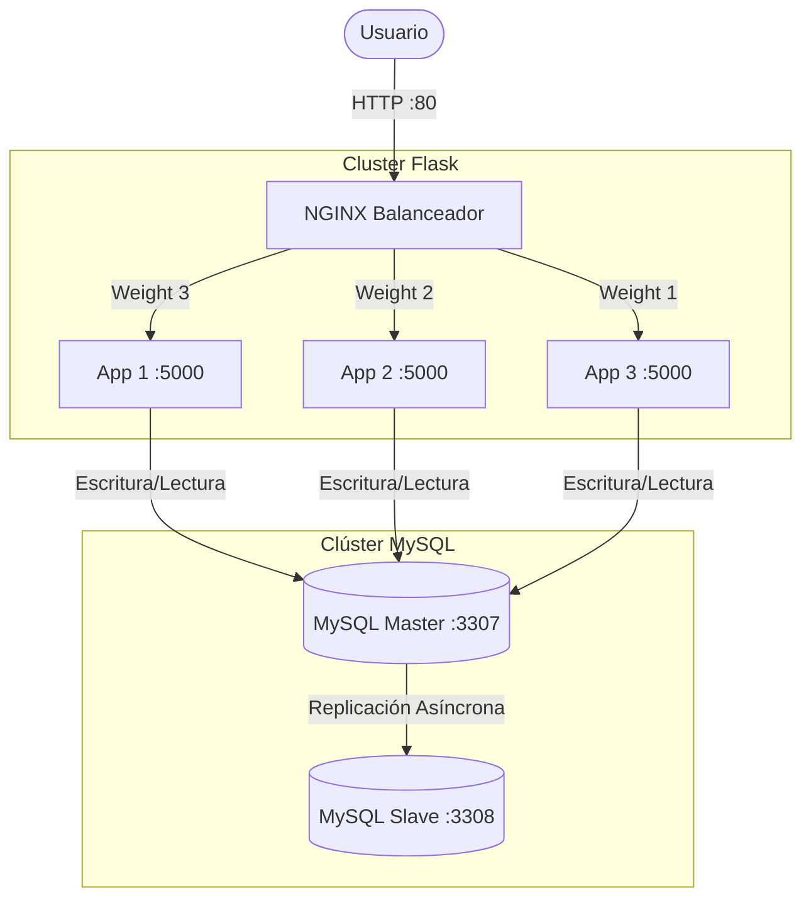

# Sistema Distribuido de Gestión de Tareas

Este proyecto implementa una aplicación web distribuida para la gestión y entrega de tareas estudiantiles. Utiliza una arquitectura basada en microservicios contenerizados (Docker), escalabilidad horizontal (NGINX), y persistencia de datos de alta disponibilidad (MySQL Master-Slave).

## Stack Tecnológico

- **Backend:** Python 3.10-slim, Flask, Gunicorn
- **Base de Datos:** MySQL 8.0, mysql-connector-python
- **Balanceador de Carga / Proxy Inverso:** NGINX (alpine)
- **Contenerización:** Docker, Docker Compose
- **Pruebas de Carga:** Locust

## Arquitectura



## Estructura del Proyecto

```text
.
├── app1.py                   # Entrypoint de la aplicación Flask
├── database.py               # Capa de acceso a datos (MySQL Connector)
├── docker-compose.yml        # Orquestación de contenedores
├── Dockerfile                # Imagen base para los nodos Flask
├── locustfile.py             # Script de pruebas de carga concurrente
├── README.md                 # Documentación técnica
├── INFORME_TECNICO.md        # Informe detallado del diseño e implementación
├── requirements.txt          # Dependencias de Python
├── routes.py                 # Enrutamiento y controladores
├── services.py               # Lógica de negocio
├── test_balanceo.py          # Script de prueba de distribución NGINX
├── db/
│   ├── init.sql              # Esquema DDL y datos semilla (users, tasks, submissions)
│   └── replication-setup.md  # Instrucciones para la replicación
├── jmeter/
│   └── plan-de-pruebas.jmx   # Plan de pruebas de JMeter
├── nginx/
│   └── nginx.conf            # Configuración del proxy reverso (Pesos 3:2:1)
└── templates/
    ├── base.html             # Layout principal (incluye footer con nodo)
    ├── dashboard.html        # Vista de tareas vigentes/vencidas
    ├── entregas.html         # Historial de entregas del estudiante
    ├── login.html            # Pantalla de autenticación
    └── tarea.html            # Interfaz de envío de respuesta
```

## Instrucciones de Instalación y Ejecución

1. **Clonar y levantar la infraestructura:**
   ```bash
   docker compose up -d --build
   ```

2. **Acceder a la aplicación:**
   - URL: `http://localhost/` (Puerto 80, NGINX enruta hacia el clúster Flask).

3. **Acceder a la Base de Datos:**
   - PhpMyAdmin: `http://localhost:8080/`
   - Servidor: `db-master`
   - Usuario: `root`
   - Contraseña: `root`

4. **Credenciales de prueba (Definidas en `init.sql`):**
   - `juan@epn.edu.ec` / `1234`
   - `maria@epn.edu.ec` / `1234`

## Comandos de Prueba (Fase 8)

### Prueba de Replicación
Verificar el estado del esclavo desde la terminal:
```bash
docker exec db-slave mysql -uroot -proot -e "SHOW REPLICA STATUS\G"
```

Verificar la llegada de una nueva entrega (tras insertarla en la web):
```bash
docker exec db-slave mysql -uroot -proot -e "SELECT * FROM app_db.submissions ORDER BY id DESC LIMIT 1;"
```

### Prueba de Distribución NGINX
Ejecutar el script en Python para validar la proporción 3:2:1:
```bash
python test_balanceo.py
```

### Prueba de Carga Concurrente (Locust)
Ejecutar la prueba de estrés de 30 usuarios:
```bash
locust -f locustfile.py --headless -u 30 -r 5 --run-time 2m --host http://localhost --html reporte_locust.html
```

## Autores
- [Josue Mejia / Joshua Morocho ]
